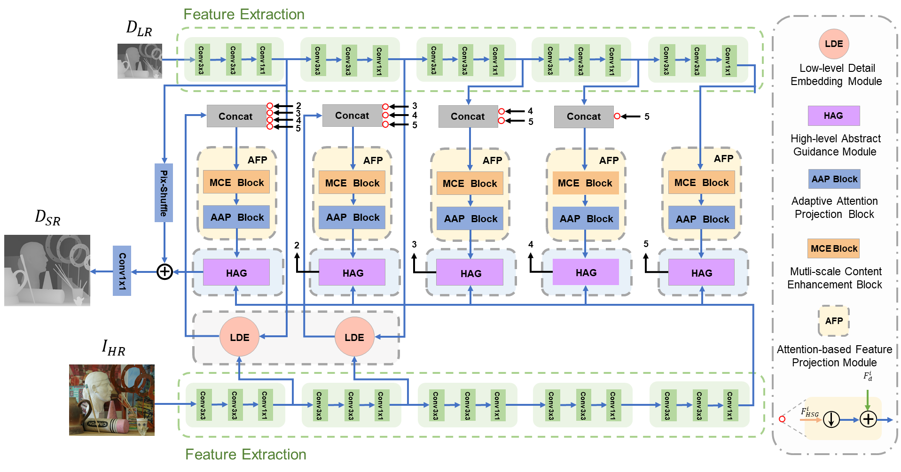
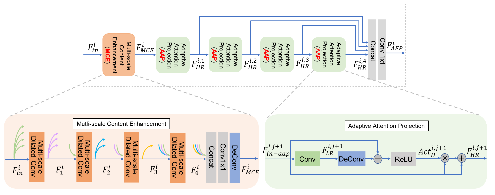
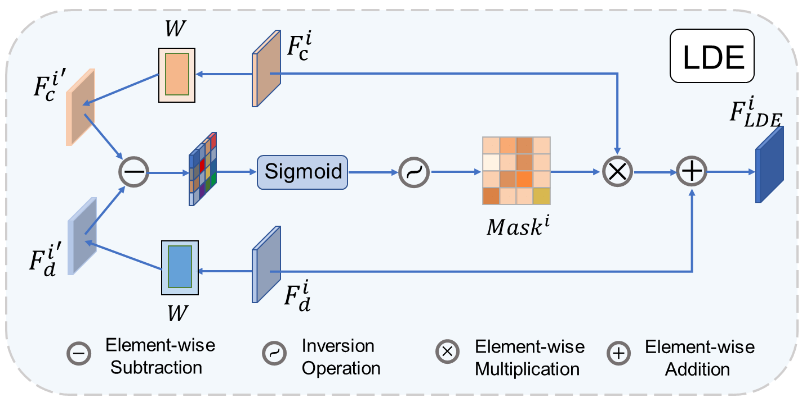
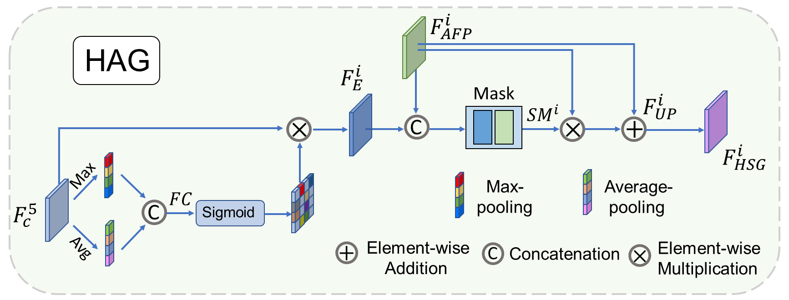
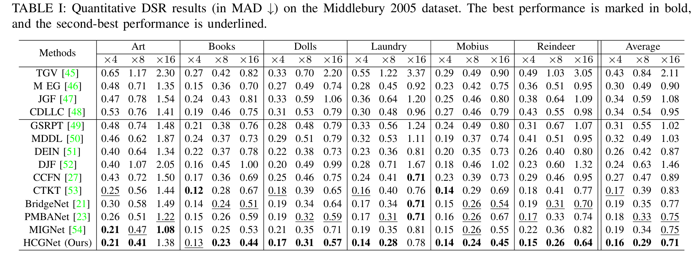
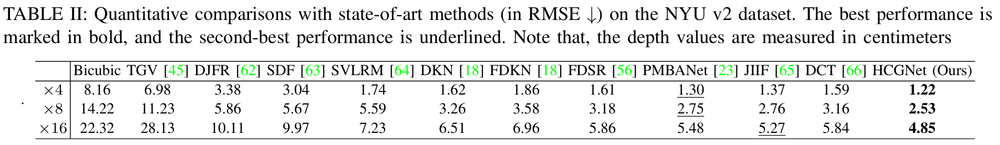
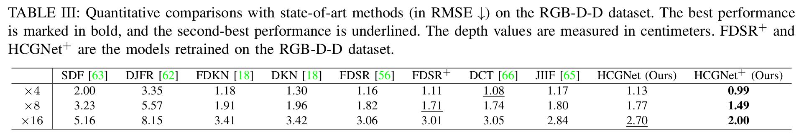
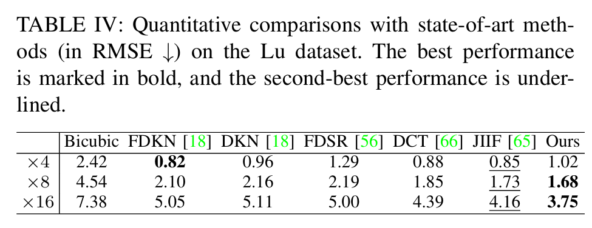

# Learning Hierarchical Color Guidance for Depth Map Super-Resolution (TIM 2024, offical)
The official pytorch implementation of the paper Learning Hierarchical Color Guidance for Depth Map Super-Resolution

Runmin Cong, Ronghui Sheng, Hao Wu, Yulan Guo, Yunchao Wei, Wangmeng Zuo, Yao Zhao and Sam Kwong


## Network
- The aper has been accepted by IEEE Transactions on Instrumentation and Measurement(TIM) 2024, you can read the [paper](https://ieeexplore.ieee.org/document/10478547) here.
- Model, the weights can be download from [Weights](https://pan.baidu.com/s/15ZZlgaWgMDA0ZNkSvRz7gg), code: mvpl




<table>
    <tr>
        <td ><center> </center></td>
        <td ><center> </center></td>
    </tr>
</table>

## How to use the code to train and test HCGNet.
### 1. Requirements
```
python 3.8.5
pytorch 1.8.0
cuda 11.7
numpy 1.19.2
timm 0.6.12
```
### 2. Data Preparation

#### Follow previous works, for Middlebury our models are trained with Middlebury datasets, and for the other three datasets our models are trained with NYU v2 dataset. 

Download and prepare the train set for Middlebury and place it in ```./data/middle_train``` [Dataset](https://pan.baidu.com/s/1TL5B8dDPUyguSmz5kWbwXA) code: mvpl

Download and prepare the train set for NYU v2 and place it in ```./data/NYUv2``` [Dataset](https://pan.baidu.com/s/1yvKpaElUyzOEJE61rDsWSA) code: mvpl

Download and prepare the test set for NYU v2 and place it in ```./data/nyu_test_16bit``` [Dataset](https://pan.baidu.com/s/18a2NI4amI_y8NcOTEJYf7Q) code: mvpl

For the test set of RGB-D-D and Lu, you can download from [GDSR](https://github.com/Zhaozixiang1228/GDSR-DCTNet) and place it in ```./data/GDSR_test``` 

The structure of `data` directory should be like
```
    data
    ├── middle_train
    │   ├── middle_patch_x4
    │   ├── middle_patch_x8
    |   ├── middle_patch_x16
    ├── midde_test
    │   ├── test_color
    │   ├── test_gt
    │   ├── test_x4
    │   ├── test_x8    
    │   ├── test_x16    
    ├── NYUv2
    │   ├── depth_train
    │   ├── RGB_train
    ├── nyu_test_16bit
    │   ├── nyu_test_gt_16bit
    │   ├── nyu_rgb_test
    ├── GDSR_test
    │   ├── Lu
    │   ├── RGBDD
    │   |   
    │   │   

```

### 3. Data Process
For the training of NYUv2 
```
python processing_trainsets.py  # replace your dataset path
```
For the testing of Lu and RGB-D-D
```
python processing_testsets.py   # replace your dataset path
```

### 4. Training and Testing
```
# Training
python3 train_middle.py       # replace your dataset path
python3 train_nyu_tim.py      # replace your dataset path

# Testing
## For Middlebury
python3 inference_middle.py   # replace your dataset path
python3 mad_test.py           # replace your dataset path

## For the NYU v2
python3 test_16bit_nyu.py     # replace your dataset path

## For the Lu and RGB-D-D
python3 test_Lu_RGBDD.py      # replace your dataset path
```

## Results





## Bibtex
If you find this work useful for your research, please consider citing the papers.
```
@article{cong2024learning,
  title={Learning Hierarchical Color Guidance for Depth Map Super-Resolution},
  author={Cong, Runmin and Sheng, Ronghui and Wu, Hao and Guo, Yulan and Wei, Yunchao and Zuo, Wangmeng and Zhao, Yao and Kwong, Sam},
  journal={IEEE Transactions on Instrumentation and Measurement},
  year={2024},
  publisher={IEEE}
}
```

## Contact Us
If you have any questions, please contact Runmin Cong at rmcong@sdu.edu.cn or Ronghui Sheng at ronghuisheng@bjtu.edu.cn.
